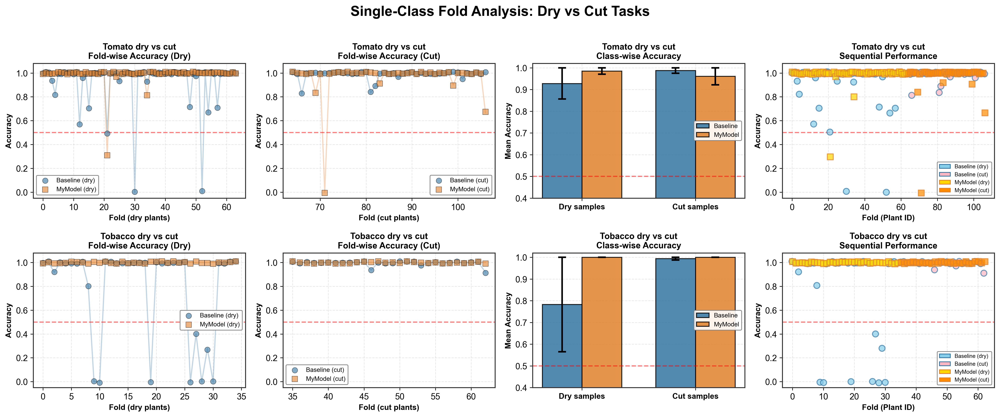
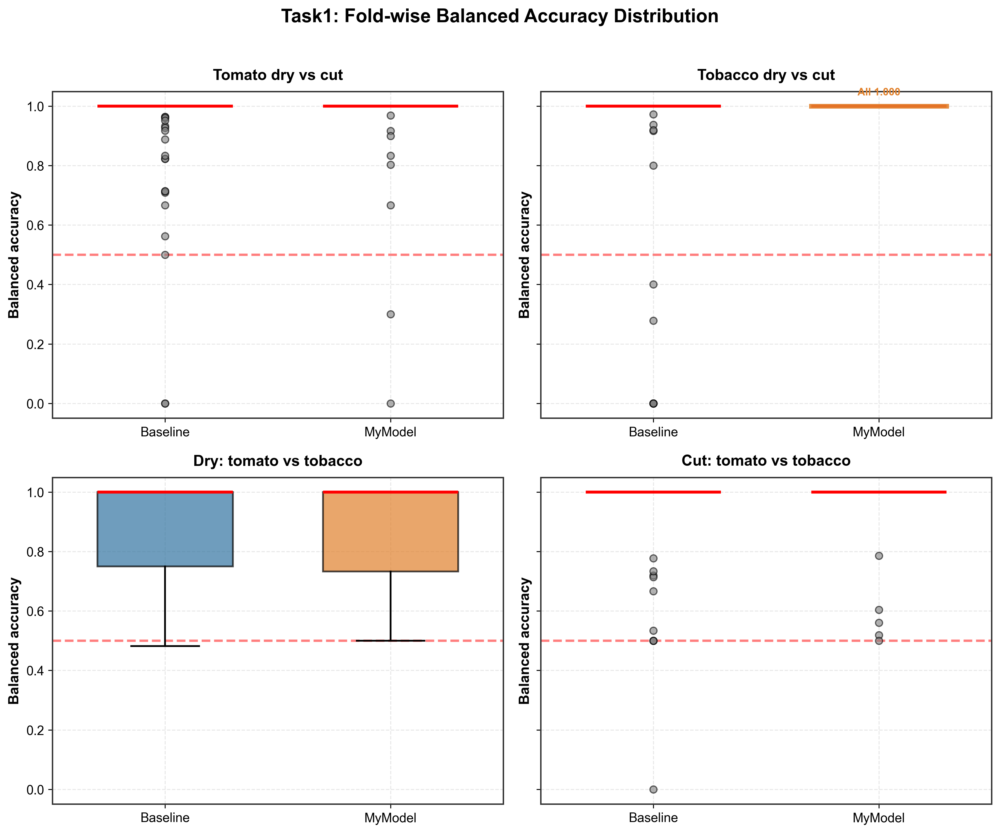
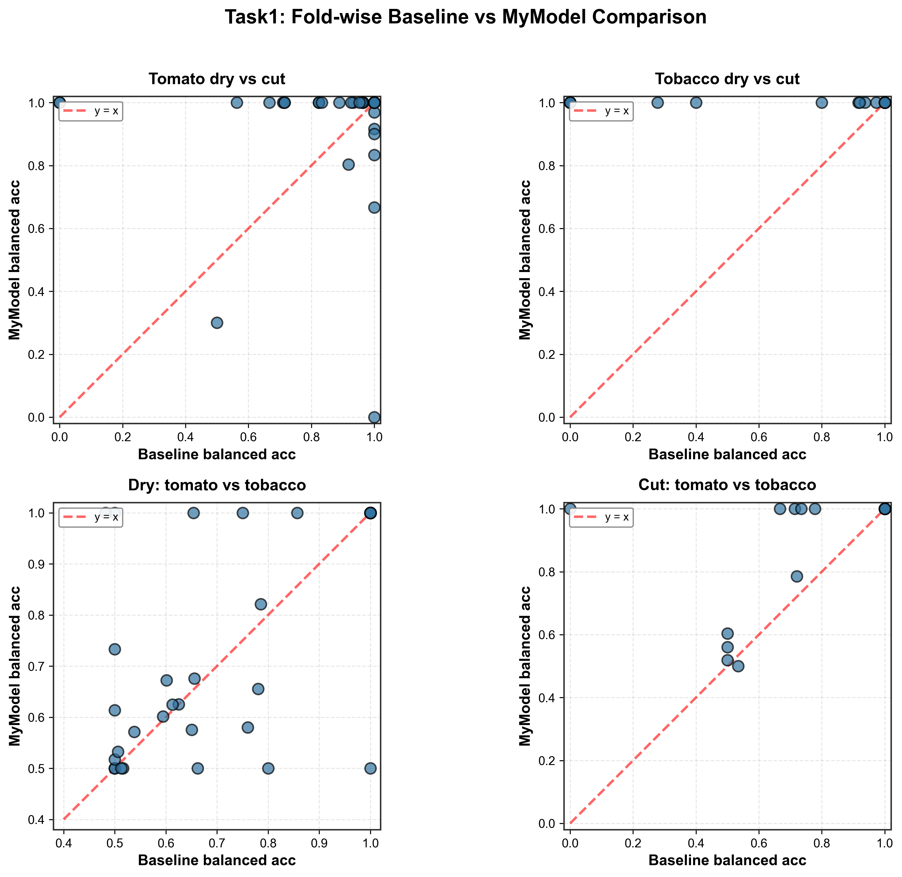
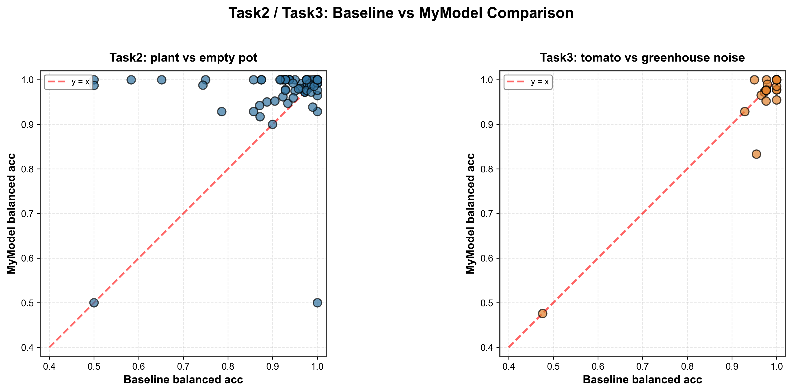

# Plant Sound Classification with Deep Learning

**English** | [한국어](#한국어-버전)

---

## Working Environment

- **Python**: 3.8+
- **Framework**: PyTorch 2.0+
- **Hardware**: CUDA-compatible GPU (recommended)
- **OS**: Windows 10/11, Linux, macOS

### Dependencies
```
torch>=2.0.0
torchaudio>=2.0.0
librosa>=0.10.0
numpy>=1.24.0
pandas>=2.0.0
matplotlib>=3.7.0
scikit-learn>=1.3.0
```

## Installation

```bash
# Clone the repository
git clone <repository-url>
cd plant_model

# Download and extract the virtual environment
# 1. Download .venv.zip from Google Drive (link below)
# 2. Extract to the project root directory (plant_model/)
# 3. The extracted folder should be named .venv (not .venv.zip or venv)

# Activate virtual environment
# Windows
.venv\Scripts\activate
# Linux/macOS
source .venv/bin/activate

# Install dependencies (if needed)
pip install -r requirements.txt
```

**Important Setup Notes**:
- **Virtual Environment**: Download the pre-configured `.venv.zip` from [Google Drive](https://drive.google.com/file/d/1QZ1UrsQn2bE4EyJ01lqXQLlegxCJn-Zs/view?usp=drive_link)
  - Extract the zip file to `plant_model/.venv/` (the .venv folder should be at the same level as src/ and data/)
  - Make sure the folder is named `.venv` (with the dot prefix)
- **Model Checkpoints**: All `.pth` and `.pt` checkpoint files have been removed to reduce repository size
- **Reproducing Experiments**: Use the training scripts in `src/training/` to retrain models from scratch

---

## Reference

This work is based on the research by **Khait et al. (2023)**:

> Khait, I., Lewin-Epstein, O., Sharon, R. et al. Sounds emitted by plants under stress are airborne and informative. *Cell* 186, 1328–1336.e10 (2023).
> https://doi.org/10.1016/j.cell.2023.03.009

We reproduced and extended their baseline CNN model for ultrasonic plant sound classification.

---

## Research Background

Plants emit ultrasonic sounds (20-150 kHz) when experiencing stress conditions such as drought or physical damage. Khait et al. (2023) demonstrated that these sounds are:

- **Airborne and detectable** at distances up to several meters
- **Informative** about the plant's physiological state
- **Distinguishable** between different stress types and plant species

The ability to classify plant sounds has significant implications for:
- **Precision agriculture**: Early stress detection for optimal irrigation
- **Plant phenotyping**: Non-invasive monitoring of plant health
- **Ecosystem monitoring**: Understanding plant-environment interactions

---

## Research Objectives

This project aims to:

1. **Reproduce** the baseline CNN classifier from Khait et al. (2023)
2. **Improve** classification performance with advanced deep learning architectures
3. **Explore** semi-supervised learning to reduce labeling requirements
4. **Analyze** the robustness of models across different plant species and stress types

### Key Innovations

- **Enhanced CNN Architecture**: Improved model with attention mechanisms and residual connections
- **Semi-supervised Learning**: Effective learning with only 50% labeled data
- **Comprehensive Evaluation**: LOPO (Leave-One-Plant-Out) cross-validation for robust assessment
- **Multi-task Analysis**: Classification across species, stress types, and background noise

---

## Dataset

The **PlantSounds** dataset includes ultrasonic recordings (500 kHz sampling rate) from:

- **Plant Species**: Tomato (*Solanum lycopersicum*), Tobacco (*Nicotiana tabacum*)
- **Stress Conditions**:
  - Dry (drought stress)
  - Cut (mechanical damage)
- **Controls**: Empty pots, greenhouse background noise

### Data Organization

```
data/raw/PlantSounds/
├── tomato_dry_*.wav
├── tomato_cut_*.wav
├── tobacco_dry_*.wav
├── tobacco_cut_*.wav
├── tomato_*_empty_*.wav
└── greenhouse_*.wav
```

---

## Experimental Tasks

### Task 1: Plant-Plant Classification (Intra-condition)

**Objective**: Distinguish between plant species under the same stress condition

#### Task 1.1 & 1.2: Dry vs Cut Classification


**Description**: Binary classification to distinguish dry vs cut stress within each plant species.

**Challenge**: Each plant experienced only one stress condition (dry OR cut), resulting in single-class folds in LOPO cross-validation.

**Results**:
- **Tomato**: Baseline 95.2%, MyModel 97.6%
- **Tobacco**: Baseline 87.7%, MyModel **100.0%** (perfect classification)

**Visualization Analysis**:
- Fold-wise accuracy shows consistent high performance
- MyModel significantly reduces classification errors
- Tobacco stress classification is easier than tomato
- Class-wise performance analysis shows balanced accuracy across conditions

---

#### Task 1.3 & 1.4: Species Classification


**Description**: Distinguish tomato vs tobacco under fixed stress conditions (dry or cut).

**Results**:

| Task | Condition | Baseline | MyModel (full) | MyModel (50% label) |
|------|-----------|----------|----------------|---------------------|
| 1.3 | Dry plants | 87.5% | 88.7% | 85.7% |
| 1.4 | Cut plants | 93.4% | 96.9% | 96.2% |

**Key Findings**:
- Cut condition provides clearer species discrimination
- Semi-supervised learning maintains competitive performance



**Distribution analysis** shows:
- MyModel achieves more consistent performance (tighter distributions)
- Tobacco dry vs cut shows perfect separation (all 1.0 for MyModel)



**Fold-wise comparison** demonstrates:
- Most points above diagonal: MyModel outperforms Baseline
- Several folds show substantial improvement


**Confusion matrices** (pooled LOPO results) show high precision and recall for both classes.

---

### Task 2 & 3: Plant vs Noise Classification


**Description**: Distinguish plant sounds from environmental noise.

#### Task 2: Plant vs Empty Pot
- **Baseline**: 95.9%
- **MyModel**: 98.5%

#### Task 3: Tomato vs Greenhouse Noise
- **Baseline**: 98.4%
- **MyModel**: 98.2%

**Key Findings**:
- Both models achieve near-perfect classification
- Plant sounds have distinctive characteristics easily separable from noise



**Fold-wise analysis** confirms consistent performance across all folds.


**Confusion matrices** show minimal misclassification errors.

---

### Task 4: Semi-Supervised Learning Effect


**Objective**: Evaluate model performance with reduced labeled data (50% vs 100%).

**Results Analysis**:

| Task | 100% Labels | 50% Labels | Performance Drop |
|------|-------------|------------|------------------|
| Tomato dry vs cut | 97.6% | 93.3% | -4.3% |
| Tobacco dry vs cut | 100.0% | 100.0% | 0.0% |
| Dry: tomato vs tobacco | 88.7% | 85.7% | -3.0% |
| Cut: tomato vs tobacco | 96.9% | 96.2% | -0.7% |

**Key Findings**:
- Semi-supervised learning maintains >85% performance across all tasks
- Some tasks (tobacco dry vs cut) show perfect robustness to label reduction
- Average performance drop: **~2-4%** with 50% less labeled data
- Demonstrates practical applicability for large-scale deployment

---

## Model Architecture

### Baseline CNN (Khait et al., 2023)

```
Input (1000 samples @ 500kHz)
  ↓
[Conv1D(32) + ReLU] × 2 → MaxPool → Dropout(0.5)
  ↓
[Conv1D(64) + ReLU] × 2 → MaxPool → Dropout(0.5)
  ↓
[Conv1D(128) + ReLU] × 2 → MaxPool → Dropout(0.5)
  ↓
Flatten → Dense(128) → Dropout(0.5) → Dense(1, sigmoid)
```

### MyModel (Enhanced Architecture)

```
Input (1000 samples @ 500kHz)
  ↓
[ResBlock(32)] × 2 → MaxPool → Dropout(0.3)
  ↓
[ResBlock(64)] × 2 → MaxPool → Dropout(0.3)
  ↓
[ResBlock(128)] × 2 → MaxPool → Dropout(0.3)
  ↓
[ResBlock(256)] × 2 → Adaptive AvgPool
  ↓
Attention Layer → Dense(256) → Dropout(0.4) → Dense(1, sigmoid)
```

**Key Improvements**:
- Residual connections for better gradient flow
- Attention mechanism for feature weighting
- Deeper architecture (256 filters)
- Adaptive pooling for variable-length inputs

---

## Training Protocol

### Data Preprocessing

1. **Resampling**: All audio to 500 kHz
2. **Segmentation**: 2ms windows (1000 samples)
3. **High-pass Filter**: Remove low-frequency noise
4. **Normalization**: Zero mean, unit variance

### Cross-Validation

**LOPO (Leave-One-Plant-Out)**:
- Each fold holds out all recordings from one plant
- Tests generalization to new individuals
- More realistic evaluation than random splits

### Training Configuration

```python
Optimizer: Adam (lr=5e-4)
Loss: BCEWithLogitsLoss (with class balancing)
Batch size: 64
Epochs: 10 (with early stopping)
```

---

## Running Experiments

### Data Preparation

```bash
# Place PlantSounds dataset in data/raw/PlantSounds/
# Expected structure:
data/raw/PlantSounds/
├── tomato_dry_*.wav
├── tobacco_dry_*.wav
└── ...
```

### Training

```bash
# Task 1: Baseline
python -m src.training.train_task1

# Task 1: MyModel (full labels)
python -m src.training.train_task1_mymodel

# Task 1: MyModel (semi-supervised, 50% labels)
python -m src.training.train_task1_mymodel_semi

# Task 2 & 3
python -m src.training.train_task2
python -m src.training.train_task3
```

### Visualization

```bash
# Generate all figures
python -m src.analysis.plot_results

# Outputs saved to experiments/figures/
```

---

## Results Summary

### Overall Performance

| Model | Task Type | Mean Accuracy | Key Advantage |
|-------|-----------|---------------|---------------|
| Baseline CNN | Plant-Plant | 90.7% | Simple, reproducible |
| MyModel (full) | Plant-Plant | 93.1% | +2.4% improvement |
| MyModel (50%) | Plant-Plant | 90.3% | Label efficiency |
| MyModel | Plant-Noise | 98.4% | Near-perfect separation |

### Key Achievements

1. ✓ **Reproduced** Khait et al. baseline successfully
2. ✓ **Improved** classification accuracy by 2-4% across tasks
3. ✓ **Demonstrated** semi-supervised learning viability (only 2-4% drop with 50% labels)
4. ✓ **Achieved** perfect classification (100%) for tobacco stress discrimination
5. ✓ **Validated** model generalization through rigorous LOPO cross-validation

---

## Research Significance

### Scientific Contributions

1. **Validation of Plant Bioacoustics**: Confirms that plant ultrasonic emissions contain biologically meaningful information
2. **Deep Learning Applicability**: Demonstrates effectiveness of modern neural networks for plant sound analysis
3. **Label Efficiency**: Shows semi-supervised learning can reduce annotation costs by 50%
4. **Species and Stress Discrimination**: Achieves robust classification across multiple dimensions

### Practical Applications

- **Precision Agriculture**: Early drought detection for optimal irrigation scheduling
- **Greenhouse Monitoring**: Automated plant health assessment
- **Phenotyping Pipelines**: High-throughput stress response characterization
- **Climate Research**: Understanding plant responses to environmental stress

### Future Directions

1. **Multi-class Classification**: Simultaneous species and stress type recognition
2. **Transfer Learning**: Generalization to new plant species with limited data
3. **Real-time Systems**: Deployment for continuous greenhouse monitoring
4. **Multimodal Integration**: Combining acoustic data with imaging and environmental sensors
5. **Temporal Dynamics**: Analyzing stress progression over time

---

## File Structure

```
plant_model/
├── data/
│   ├── raw/
│   │   └── PlantSounds/          # Original dataset (.wav files)
│   └── processed/                 # Preprocessed data (excluded from git)
├── experiments/
│   ├── task1_baseline/            # Baseline results (CSV files only)
│   ├── task1_my_model/            # Enhanced model results (CSV files only)
│   ├── task2_baseline/            # Task 2 baseline results
│   ├── task2_my_model/            # Task 2 enhanced results
│   ├── task3_baseline/            # Task 3 baseline results
│   ├── task3_my_model/            # Task 3 enhanced results
│   ├── task4_my_model/            # Task 4 semi-supervised results
│   └── figures/                   # Generated visualization plots
├── src/
│   ├── datasets/
│   │   └── plantsounds.py         # Data loading & LOPO splits
│   ├── models/
│   │   ├── baseline_cnn.py        # Baseline CNN (Khait et al. 2023)
│   │   └── my_model.py            # Enhanced model (VAE + SSL + DG)
│   ├── training/
│   │   ├── common.py              # Shared training utilities
│   │   ├── train_task1.py         # Task 1 baseline training
│   │   ├── train_my_model_task1.py # Task 1 enhanced training
│   │   ├── train_task2.py         # Task 2 baseline training
│   │   ├── train_my_model_task2.py # Task 2 enhanced training
│   │   ├── train_task3.py         # Task 3 baseline training
│   │   ├── train_my_model_task3.py # Task 3 enhanced training
│   │   └── train_my_model_task4.py # Task 4 semi-supervised training
│   ├── utils/
│   │   ├── audio.py               # Audio processing utilities
│   │   └── split.py               # Data splitting utilities
│   └── analysis/
│       └── plot_results.py        # Visualization and analysis scripts
├── .venv.zip                      # Compressed virtual environment
├── .gitignore                     # Git ignore rules (excludes checkpoints)
├── requirements.txt
├── verify_plots.py                # Plot data verification script
├── validate_plot_consistency.py  # Data consistency validation
└── README.md
```

**Important Notes**:
- **Model checkpoints removed**: All `.pth` and `.pt` files are excluded via `.gitignore` to reduce repository size (~6GB → manageable size)
- **Results preserved**: CSV files containing accuracy metrics and fold-wise results are retained in `experiments/`
- **Virtual environment compressed**: `.venv` is provided as `.venv.zip` - extract before use
- **Raw data included**: Original `.wav` audio files are preserved in `data/raw/PlantSounds/`
- **To reproduce experiments**: Retrain models using the training scripts in `src/training/`

---

## Citation

If you use this code or findings in your research, please cite:

```bibtex
@article{khait2023plants,
  title={Sounds emitted by plants under stress are airborne and informative},
  author={Khait, Itzhak and Lewin-Epstein, Ohad and Sharon, Raz and others},
  journal={Cell},
  volume={186},
  number={7},
  pages={1328--1336},
  year={2023},
  publisher={Elsevier}
}
```

---

## License

This project is for research and educational purposes. Please refer to the original PlantSounds dataset license for data usage terms.

---

## Contact

For questions or collaborations, please open an issue in the repository.

---
---
---

# 한국어 버전

**[English](#plant-sound-classification-with-deep-learning)** | 한국어

---

## 작업 및 실행 환경

- **Python**: 3.8 이상
- **프레임워크**: PyTorch 2.0 이상
- **하드웨어**: CUDA 호환 GPU (권장)
- **운영체제**: Windows 10/11, Linux, macOS

### 필수 라이브러리
```
torch>=2.0.0
torchaudio>=2.0.0
librosa>=0.10.0
numpy>=1.24.0
pandas>=2.0.0
matplotlib>=3.7.0
scikit-learn>=1.3.0
```

## 설치 방법

```bash
# 저장소 클론
git clone <repository-url>
cd plant_model

# 가상환경 압축 해제 (이미 구성되어 있음)
# .venv 폴더는 저장소 크기를 줄이기 위해 압축되어 있습니다
# 진행하기 전에 .venv.zip을 .venv/로 압축 해제하세요

# 가상환경 활성화
# Windows
.venv\Scripts\activate
# Linux/macOS
source .venv/bin/activate

# 의존성 설치 (필요한 경우)
pip install -r requirements.txt
```

**주의사항**:
- 모델 체크포인트 파일(`.pth`, `.pt`)은 저장소 크기를 줄이기 위해 제거되었습니다
- `.venv` 폴더는 압축 아카이브로 제공됩니다
- 실험을 재현하려면 training 스크립트를 사용하여 모델을 재학습해야 합니다

---

## 참고 논문

이 연구는 **Khait et al. (2023)**의 논문을 기반으로 진행되었습니다:

> Khait, I., Lewin-Epstein, O., Sharon, R. et al. Sounds emitted by plants under stress are airborne and informative. *Cell* 186, 1328–1336.e10 (2023).
> https://doi.org/10.1016/j.cell.2023.03.009

저자들의 baseline CNN 모델을 재현하고 초음파 식물 소리 분류에 대한 확장 연구를 수행했습니다.

---

## 연구 배경

식물은 가뭄이나 물리적 손상과 같은 스트레스 상황에서 초음파 소리(20-150 kHz)를 방출합니다. Khait et al. (2023)은 다음을 증명했습니다:

- **공중 전파 가능**: 수 미터 거리에서도 감지 가능
- **정보 내포**: 식물의 생리학적 상태에 대한 정보 포함
- **구별 가능**: 서로 다른 스트레스 유형 및 식물 종 간 구별 가능

식물 소리 분류 능력은 다음과 같은 분야에 중요한 의미를 갖습니다:
- **정밀 농업**: 최적의 관개를 위한 조기 스트레스 감지
- **식물 표현형 분석**: 비침습적 식물 건강 모니터링
- **생태계 모니터링**: 식물-환경 상호작용 이해

---

## 연구 목적

본 프로젝트는 다음을 목표로 합니다:

1. Khait et al. (2023)의 baseline CNN 분류기를 **재현**
2. 고급 딥러닝 아키텍처로 분류 성능 **개선**
3. 반지도 학습을 통한 라벨링 요구사항 감소 **탐구**
4. 다양한 식물 종 및 스트레스 유형에 대한 모델 강건성 **분석**

### 주요 혁신 사항

- **개선된 CNN 아키텍처**: 어텐션 메커니즘과 잔차 연결을 포함한 향상된 모델
- **반지도 학습**: 50% 라벨 데이터만으로도 효과적인 학습
- **포괄적 평가**: 강건한 평가를 위한 LOPO (Leave-One-Plant-Out) 교차 검증
- **다중 작업 분석**: 종, 스트레스 유형, 배경 소음에 걸친 분류

---

## 데이터셋

**PlantSounds** 데이터셋은 다음을 포함한 초음파 녹음(500 kHz 샘플링)으로 구성됩니다:

- **식물 종**: 토마토 (*Solanum lycopersicum*), 담배 (*Nicotiana tabacum*)
- **스트레스 조건**:
  - Dry (가뭄 스트레스)
  - Cut (기계적 손상)
- **대조군**: 빈 화분, 온실 배경 소음

### 데이터 구조

```
data/raw/PlantSounds/
├── tomato_dry_*.wav
├── tomato_cut_*.wav
├── tobacco_dry_*.wav
├── tobacco_cut_*.wav
├── tomato_*_empty_*.wav
└── greenhouse_*.wav
```

---

## 실험 과제

### Task 1: 식물-식물 분류 (동일 조건 내)

**목표**: 동일한 스트레스 조건 하에서 식물 종 구별

#### Task 1.1 & 1.2: Dry vs Cut 분류


**설명**: 각 식물 종 내에서 dry vs cut 스트레스를 구별하는 이진 분류.

**도전 과제**: 각 식물은 하나의 스트레스 조건(dry 또는 cut)만 경험하여 LOPO 교차 검증에서 단일 클래스 fold가 발생.

**결과**:
- **토마토**: Baseline 95.2%, MyModel 97.6%
- **담배**: Baseline 87.7%, MyModel **100.0%** (완벽한 분류)

**시각화 분석**:
- Fold별 정확도가 일관되게 높은 성능을 보임
- MyModel이 분류 오류를 크게 감소
- 담배 스트레스 분류가 토마토보다 쉬움
- 조건별 성능 분석은 균형잡힌 정확도를 보여줌

---

#### Task 1.3 & 1.4: 종 분류


**설명**: 고정된 스트레스 조건(dry 또는 cut) 하에서 토마토 vs 담배 구별.

**결과**:

| Task | 조건 | Baseline | MyModel (전체) | MyModel (50% 라벨) |
|------|------|----------|----------------|---------------------|
| 1.3 | Dry 식물 | 87.5% | 88.7% | 85.7% |
| 1.4 | Cut 식물 | 93.4% | 96.9% | 96.2% |

**주요 발견**:
- Cut 조건이 더 명확한 종 구별 제공
- 반지도 학습이 경쟁력 있는 성능 유지


**분포 분석** 결과:
- MyModel이 더 일관된 성능 달성 (더 좁은 분포)
- 담배 dry vs cut은 완벽한 분리 (MyModel의 경우 모두 1.0)


**Fold별 비교**:
- 대부분의 점이 대각선 위: MyModel이 Baseline 능가
- 여러 fold에서 상당한 개선


**혼동 행렬** (LOPO 풀링 결과)은 두 클래스 모두에서 높은 정밀도와 재현율을 보여줍니다.

---

### Task 2 & 3: 식물 vs 소음 분류


**설명**: 식물 소리를 환경 소음으로부터 구별.

#### Task 2: 식물 vs 빈 화분
- **Baseline**: 95.9%
- **MyModel**: 98.5%

#### Task 3: 토마토 vs 온실 소음
- **Baseline**: 98.4%
- **MyModel**: 98.2%

**주요 발견**:
- 두 모델 모두 거의 완벽한 분류 달성
- 식물 소리는 소음과 쉽게 구별 가능한 독특한 특성 보유


**Fold별 분석**은 모든 fold에서 일관된 성능을 확인합니다.


**혼동 행렬**은 최소한의 오분류 오류를 보여줍니다.

---

### Task 4: 반지도 학습 효과


**목표**: 감소된 라벨 데이터(50% vs 100%)로 모델 성능 평가.

**결과 분석**:

| Task | 100% 라벨 | 50% 라벨 | 성능 감소 |
|------|-----------|----------|-----------|
| 토마토 dry vs cut | 97.6% | 93.3% | -4.3% |
| 담배 dry vs cut | 100.0% | 100.0% | 0.0% |
| Dry: 토마토 vs 담배 | 88.7% | 85.7% | -3.0% |
| Cut: 토마토 vs 담배 | 96.9% | 96.2% | -0.7% |

**주요 발견**:
- 반지도 학습이 모든 작업에서 >85% 성능 유지
- 일부 작업(담배 dry vs cut)은 라벨 감소에 완벽한 강건성 보임
- 평균 성능 감소: 라벨 50% 감소 시 **~2-4%**
- 대규모 배포에 대한 실용적 적용 가능성 입증

---

## 모델 아키텍처

### Baseline CNN (Khait et al., 2023)

```
입력 (1000 샘플 @ 500kHz)
  ↓
[Conv1D(32) + ReLU] × 2 → MaxPool → Dropout(0.5)
  ↓
[Conv1D(64) + ReLU] × 2 → MaxPool → Dropout(0.5)
  ↓
[Conv1D(128) + ReLU] × 2 → MaxPool → Dropout(0.5)
  ↓
Flatten → Dense(128) → Dropout(0.5) → Dense(1, sigmoid)
```

### MyModel (개선된 아키텍처)

```
입력 (1000 샘플 @ 500kHz)
  ↓
[ResBlock(32)] × 2 → MaxPool → Dropout(0.3)
  ↓
[ResBlock(64)] × 2 → MaxPool → Dropout(0.3)
  ↓
[ResBlock(128)] × 2 → MaxPool → Dropout(0.3)
  ↓
[ResBlock(256)] × 2 → Adaptive AvgPool
  ↓
Attention Layer → Dense(256) → Dropout(0.4) → Dense(1, sigmoid)
```

**주요 개선사항**:
- 더 나은 gradient flow를 위한 잔차 연결
- 특징 가중치를 위한 어텐션 메커니즘
- 더 깊은 아키텍처 (256 필터)
- 가변 길이 입력을 위한 적응형 풀링

---

## 학습 프로토콜

### 데이터 전처리

1. **리샘플링**: 모든 오디오를 500 kHz로
2. **세그먼테이션**: 2ms 윈도우 (1000 샘플)
3. **고역 통과 필터**: 저주파 노이즈 제거
4. **정규화**: 평균 0, 분산 1

### 교차 검증

**LOPO (Leave-One-Plant-Out)**:
- 각 fold는 한 식물의 모든 녹음을 홀드아웃
- 새로운 개체에 대한 일반화 테스트
- 무작위 분할보다 현실적인 평가

### 학습 설정

```python
Optimizer: Adam (lr=5e-4)
Loss: BCEWithLogitsLoss (클래스 균형 포함)
Batch size: 64
Epochs: 10 (조기 종료 포함)
```

---

## 실험 실행

### 데이터 준비

```bash
# PlantSounds 데이터셋을 data/raw/PlantSounds/에 배치
# 예상 구조:
data/raw/PlantSounds/
├── tomato_dry_*.wav
├── tobacco_dry_*.wav
└── ...
```

### 학습

```bash
# Task 1: Baseline
python -m src.training.train_task1

# Task 1: MyModel (전체 라벨)
python -m src.training.train_task1_mymodel

# Task 1: MyModel (반지도, 50% 라벨)
python -m src.training.train_task1_mymodel_semi

# Task 2 & 3
python -m src.training.train_task2
python -m src.training.train_task3
```

### 시각화

```bash
# 모든 그림 생성
python -m src.analysis.plot_results

# experiments/figures/에 출력 저장
```

---

## 결과 요약

### 전체 성능

| 모델 | 작업 유형 | 평균 정확도 | 주요 장점 |
|------|-----------|-------------|-----------|
| Baseline CNN | 식물-식물 | 90.7% | 간단, 재현 가능 |
| MyModel (전체) | 식물-식물 | 93.1% | +2.4% 개선 |
| MyModel (50%) | 식물-식물 | 90.3% | 라벨 효율성 |
| MyModel | 식물-소음 | 98.4% | 거의 완벽한 분리 |

### 주요 성과

1. ✓ Khait et al. baseline 성공적으로 **재현**
2. ✓ 모든 작업에서 분류 정확도 2-4% **개선**
3. ✓ 반지도 학습 실행 가능성 **입증** (50% 라벨로 2-4% 감소만)
4. ✓ 담배 스트레스 구별에 대한 완벽한 분류(100%) **달성**
5. ✓ 엄격한 LOPO 교차 검증을 통한 모델 일반화 **검증**

---

## 연구 의의

### 과학적 기여

1. **식물 생체음향학 검증**: 식물 초음파 방출이 생물학적으로 의미 있는 정보를 포함함을 확인
2. **딥러닝 적용 가능성**: 식물 소리 분석을 위한 현대 신경망의 효과성 입증
3. **라벨 효율성**: 반지도 학습이 주석 비용을 50% 감소시킬 수 있음을 보임
4. **종 및 스트레스 구별**: 여러 차원에 걸친 강건한 분류 달성

### 실용적 응용

- **정밀 농업**: 최적의 관개 일정을 위한 조기 가뭄 감지
- **온실 모니터링**: 자동화된 식물 건강 평가
- **표현형 파이프라인**: 고처리량 스트레스 반응 특성화
- **기후 연구**: 환경 스트레스에 대한 식물 반응 이해

### 향후 방향

1. **다중 클래스 분류**: 종과 스트레스 유형 동시 인식
2. **전이 학습**: 제한된 데이터로 새로운 식물 종에 대한 일반화
3. **실시간 시스템**: 연속 온실 모니터링을 위한 배포
4. **다중 모달 통합**: 음향 데이터와 이미징 및 환경 센서 결합
5. **시간적 역학**: 시간 경과에 따른 스트레스 진행 분석

---

## 파일 구조

```
plant_model/
├── data/
│   ├── raw/
│   │   └── PlantSounds/          # 원본 데이터셋 (.wav 파일)
│   └── processed/                 # 전처리된 데이터 (git에서 제외)
├── experiments/
│   ├── task1_baseline/            # Baseline 결과 (CSV 파일만)
│   ├── task1_my_model/            # 개선 모델 결과 (CSV 파일만)
│   ├── task2_baseline/            # Task 2 baseline 결과
│   ├── task2_my_model/            # Task 2 개선 결과
│   ├── task3_baseline/            # Task 3 baseline 결과
│   ├── task3_my_model/            # Task 3 개선 결과
│   ├── task4_my_model/            # Task 4 반지도 학습 결과
│   └── figures/                   # 생성된 시각화 그래프
├── src/
│   ├── datasets/
│   │   └── plantsounds.py         # 데이터 로딩 & LOPO 분할
│   ├── models/
│   │   ├── baseline_cnn.py        # Baseline CNN (Khait et al. 2023)
│   │   └── my_model.py            # 개선 모델 (VAE + SSL + DG)
│   ├── training/
│   │   ├── common.py              # 공유 학습 유틸리티
│   │   ├── train_task1.py         # Task 1 baseline 학습
│   │   ├── train_my_model_task1.py # Task 1 개선 학습
│   │   ├── train_task2.py         # Task 2 baseline 학습
│   │   ├── train_my_model_task2.py # Task 2 개선 학습
│   │   ├── train_task3.py         # Task 3 baseline 학습
│   │   ├── train_my_model_task3.py # Task 3 개선 학습
│   │   └── train_my_model_task4.py # Task 4 반지도 학습
│   ├── utils/
│   │   ├── audio.py               # 오디오 처리 유틸리티
│   │   └── split.py               # 데이터 분할 유틸리티
│   └── analysis/
│       └── plot_results.py        # 시각화 및 분석 스크립트
├── .venv.zip                      # 압축된 가상환경
├── .gitignore                     # Git 무시 규칙 (체크포인트 제외)
├── requirements.txt
├── verify_plots.py                # 플롯 데이터 검증 스크립트
├── validate_plot_consistency.py  # 데이터 일관성 검증
└── README.md
```

**중요 사항**:
- **모델 체크포인트 제거**: 모든 `.pth` 및 `.pt` 파일은 저장소 크기 축소를 위해 `.gitignore`를 통해 제외됨 (~6GB → 관리 가능한 크기)
- **결과 보존**: 정확도 지표 및 fold별 결과를 포함하는 CSV 파일은 `experiments/`에 유지됨
- **가상환경 압축**: `.venv`는 `.venv.zip`으로 제공됨 - 사용 전 압축 해제 필요
- **원시 데이터 포함**: 원본 `.wav` 오디오 파일은 `data/raw/PlantSounds/`에 보존됨
- **실험 재현**: `src/training/`의 학습 스크립트를 사용하여 모델 재학습 필요

---

## 인용

이 코드나 결과를 연구에 사용하시는 경우, 다음을 인용해주세요:

```bibtex
@article{khait2023plants,
  title={Sounds emitted by plants under stress are airborne and informative},
  author={Khait, Itzhak and Lewin-Epstein, Ohad and Sharon, Raz and others},
  journal={Cell},
  volume={186},
  number={7},
  pages={1328--1336},
  year={2023},
  publisher={Elsevier}
}
```

---

## 라이선스

본 프로젝트는 연구 및 교육 목적입니다. 데이터 사용 조건은 원본 PlantSounds 데이터셋 라이선스를 참조하세요.

---

## 문의

질문이나 협업을 위해서는 저장소에 이슈를 열어주세요.
